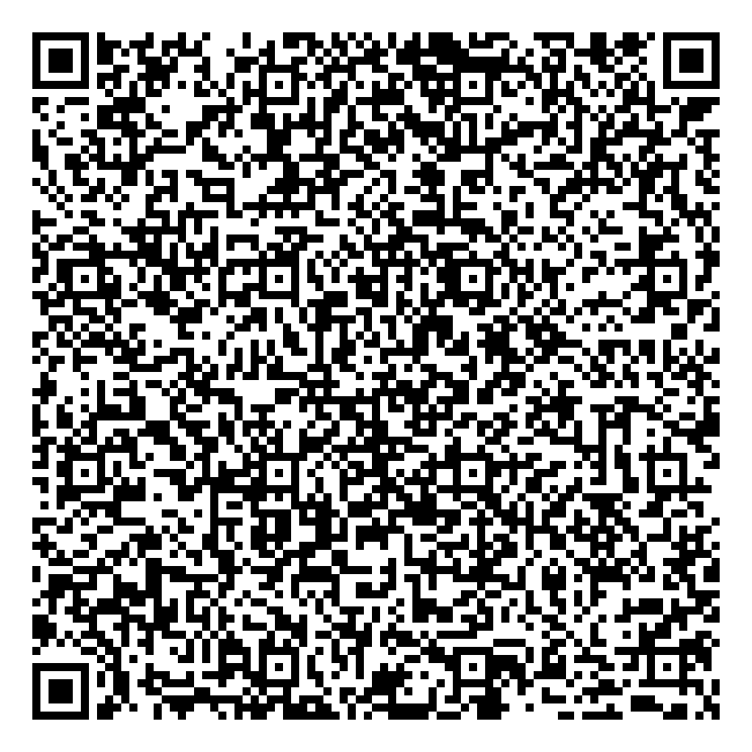
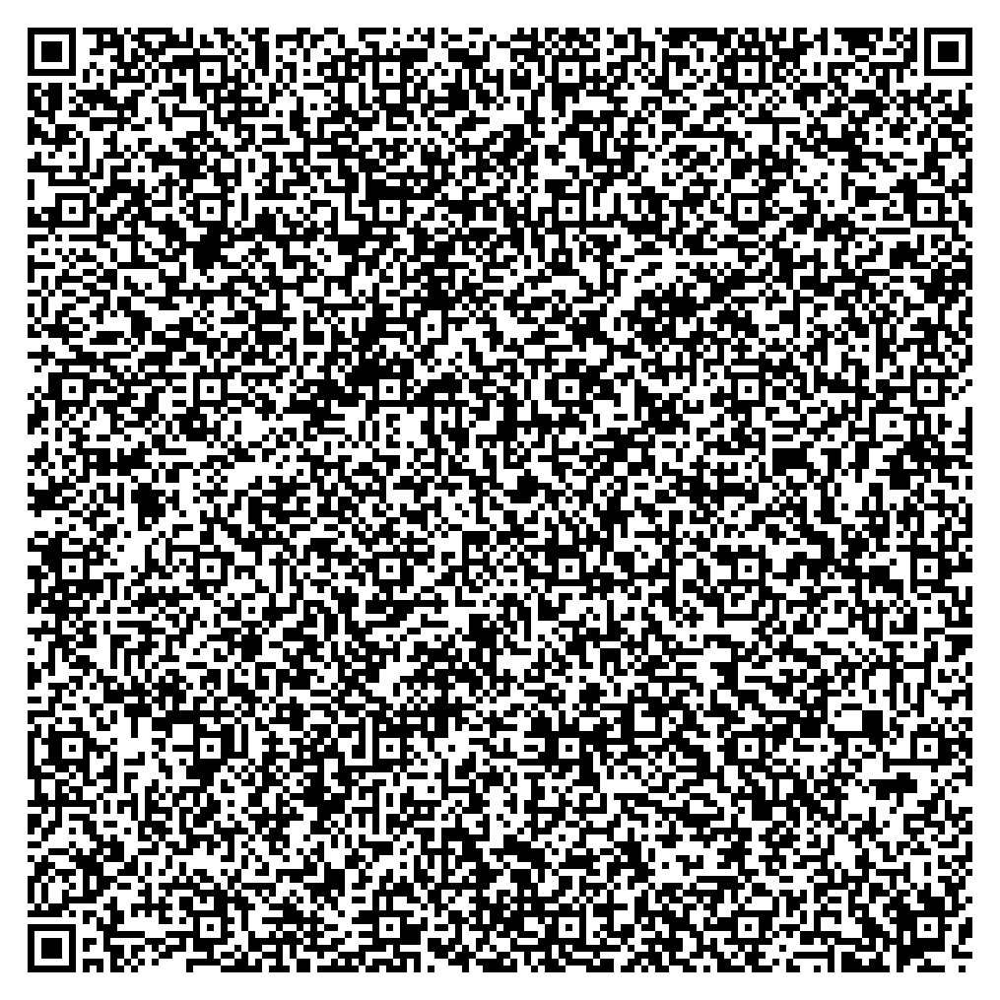

It must have been my 6th birthday when I got this fabulous book from my dad called [De schaal van Richter en andere getallen](http://www.vanmaanen.org/hans/boeken/svr.html) (Richter's scale and other numbers). The book explains many of the codes and numbers we encounter everyday but most people either ignore or remain blissfully unaware of. Think of the numbers on the side of car tires, on trains, road numbering systems, various indexes or scales for natural phenomena etc. It also explained various types of barcodes (ISBN / EAN / DX Film), usually found on everyday stuff you buy. In a time before the internet, books like these where a real treasure trove, especially for a little poindexter like 6yo me.
<!-- more -->

* TOC
{:toc}

## Background
With the mass adoption of smartphones with cameras, barcodes (especially [QR codes](https://en.wikipedia.org/wiki/QR_code)) gained in popularity. Often used to exchange information such as [contact information](https://en.wikipedia.org/wiki/VCard), [calendar events](https://en.wikipedia.org/wiki/ICalendar#Events_.28VEVENT.29) or WiFi access codes. These are not part of the QR Code standard however. Like most barcodes, they simply contain data (text and numbers) and leave the interpretation to the application.

My interest in barcodes revived while I was investigating ways of long term storage of sensitive data. Having built and maintained datacenters for 15 odd years, I am quite aware of pitfalls in long term storage using electronic media. Apart from straight up failure / corruption there is the concern of compatibility. Will I be able to decode my information in the future and will the hardware still be around when I need it. For example, what would you do if you wanted to recover some information from a 5.25" floppy disk formatted in Atari 8-bit? Given enough time and resources you would probably be able to find the necessary hardware, and figure out how to read the disk but it will be far from easy. Think about it, the technology is "only" 30 years old and already eradicated completely, from a practical perspective.

I think I can deal with not being able to recover my notes from when I was a kid, or the saved goals from [Kick Off 2](https://en.wikipedia.org/wiki/Kick_Off_(series)#Kick_Off_2), even though there were some real beauties there. However, as I grow older I am becoming more concerned with proper long term storage of rather important information. Some examples are private keys (PGP / SSH / passphrases) or cold storage of digital currency. Can barcodes somehow aid in dealing with these issues?

## Considerations
There is extensive experience with storing information on paper, it has a proven track record and the handling and storage of documents is well understood by everyone. This more or less tackles the issue with mechanical (hardware) failure, and as an added benefit, it allows for easy and secure deletion. Burn baby burn.

The format used for storing the data on paper should be well documented, and preferably trivial to implement from the specification in the extreme case it goes out of fashion. It should also be "open", i.e. not some proprietary format which might lead to any legal issues or dependency on some copyright/patent holder.

Some stuff you can just print out as is, but for some things it is also necessary to have an easy way of re-digitizing it.  Manually typing in 4096 bytes is manageable but quite error prone and very tedious. Imagine the pain if you need to digitize 10 times that. OCR is an option but this problem is actually exactly what barcodes have been invented for.

Lastly there is the issue of data integrity. Even though it would be a good idea to have this already present in the original data, an additional independant layer of error correction seems to make a lot of sense. Obvioulsy the format should also be able to hold the amount of information you want to store, preferably without resorting to splitting the information in multiple chunks.

Luckily there are plenty [barcode formats](https://en.wikipedia.org/wiki/Barcode#Matrix_.282D.29_barcodes) to choose from, of which at least some seem to fit the bill.

## Creation
There are many [online](http://www.barcodesinc.com/generator/index.php) [barcode](http://www.barcode-generator.org/) [generators](http://www.terryburton.co.uk/barcodewriter/generator/) which is very convenient if you quickly need to generate one for whatever reason. There are however certain limitations/downsides, apart from having to be connected. I suspect (although I haven't checked) most of these do not provide an API for programmatic / bulk generation. Of course this is not an issue if you want to generate a barcode only once. You can find a more detailed overview [here](https://qrworld.wordpress.com/2011/06/07/qr-code-generators/).

Even if there would be bulk/API generators online, another problem is the need for you to send the data you are generating barcodes over the net. It will be processed by a third party (and as we all know by know, probably 10 other parties as well) with obvious privacy/security implications.

If you are only looking to create QR codes, you could use [qrencode](https://fukuchi.org/works/qrencode/) which on some systems is as easy as `sudo apt-get install qrencode`. Because I wanted to play around with different types of barcodes I was looking for something a bit more elaborate. Most of the software that supprts multiple barcode formats are not free but fortunately there is a very nice library called [Barcode Writer in Pure PostScript](http://bwipp.terryburton.co.uk/) currently maintained by [Terry Burton](https://github.com/terryburton). Someone has also been nice enough to write a python binding for this which is called [elaphe](https://pypi.python.org/pypi/elaphe/) which makes it very practical to use.

## Implementations
Let's examine some typical usage scenarios

### WiFi Information
Android seems to recognize the following format for WiFi AP information:

> `WIFI:T:AUTHENTICATION;S:SSID;P:PSK;H:HIDDEN;`

Where:

| AUTHENTICATION | WEP \| WPA \| nopass |
| SSID | Network SSID (required) |
| PSK | Password or Pre-shared key (required) |
| HIDDEN | true \| false |

Simply generate a QR code or Data Matrix with that raw string as content and scanning it with the (default) ZXing scanner on Android offers you the option to connect. I don't think it works on iOS, and haven't tested on anything else.

 

### Business Cards / Calendar Events
The de facto standard for exchanging contact information is [vCard](https://en.wikipedia.org/wiki/VCard), example:

~~~
BEGIN:VCARD
VERSION:4.0
N:Gump;Forrest;;;
FN:Forrest Gump
ORG:Bubba Gump Shrimp Co.
TITLE:Shrimp Man
PHOTO;MEDIATYPE=image/gif:http://www.example.com/dir_photos/my_photo.gif
TEL;TYPE=work,voice;VALUE=uri:tel:+1-111-555-1212
TEL;TYPE=home,voice;VALUE=uri:tel:+1-404-555-1212
ADR;TYPE=work;LABEL="100 Waters Edge\nBaytown, LA 30314\nUnited States of A
 merica":;;100 Waters Edge;Baytown;LA;30314;United States of America
ADR;TYPE=home;LABEL="42 Plantation St.\nBaytown, LA 30314\nUnited States of
 America":;;42 Plantation St.;Baytown;LA;30314;United States of America
EMAIL:forrestgump@example.com
REV:20080424T195243Z
END:VCARD
~~~

And in a very similar way we can use the [vEvent](https://en.wikipedia.org/wiki/ICalendar#Events_.28VEVENT.29) format to share event information.

### SSH Keys
This is where it starts to get more interesting..  a default RSA key of length 2048 results in a private key file of 1679 characters. Well within the theoretical limits of a QR code.

~~~
$ ssh-keygen -t rsa

Generating public/private rsa key pair.
Enter file in which to save the key (./id_rsa): ./id_rsa
./id_rsa already exists.
Overwrite (y/n)? y
Enter passphrase (empty for no passphrase):
Enter same passphrase again:
Your identification has been saved in ./id_rsa.
Your public key has been saved in ./id_rsa.pub.
~~~

Scanning this QR code without any issues on my phone, diffing with the original.. no problem.

But generating a 4096 bit key with `ssh-keygen -t rsa -b 4096` results in a private key file of 3247 characters. This would require at least a Version 35 when using 'Low' error correction or Verison 40 if you want 'Medium' error correction. This is where most online generators start to break down. I have created both using elaphe and found
### Bitcoin Wallet

### Other

### GnuPG Keys